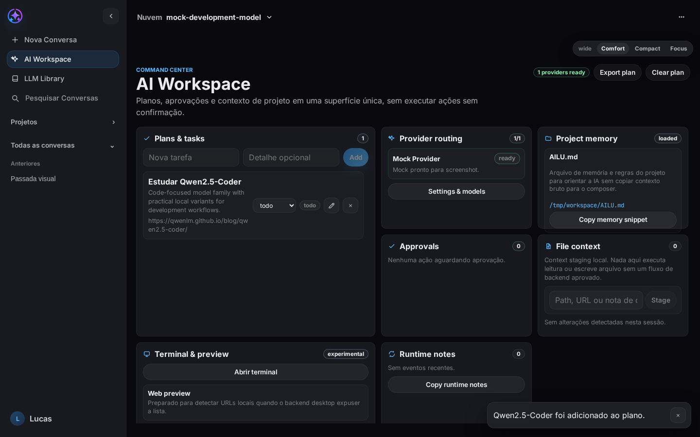
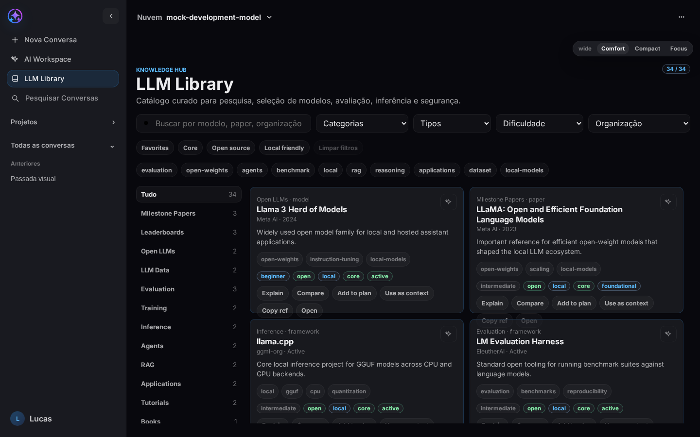
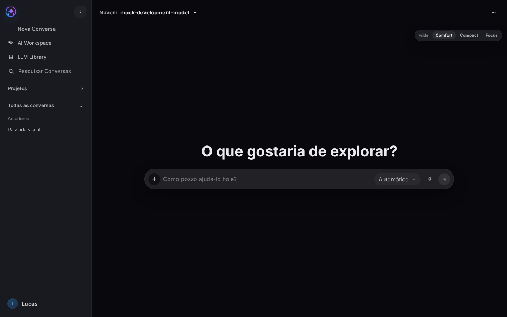
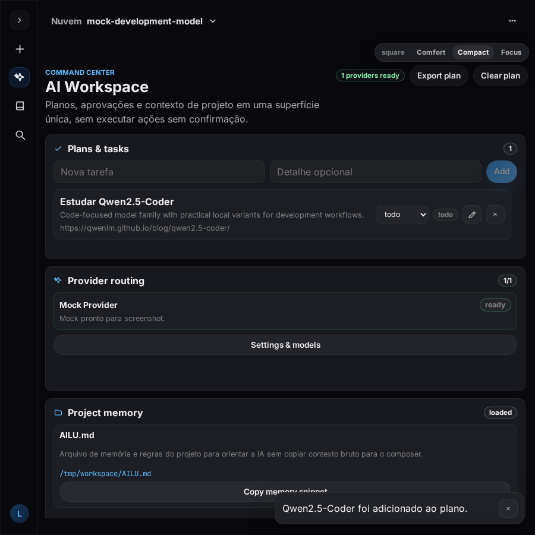

<p align="center">
  
</p>

<h1 align="center">Ailu AI Studio</h1>

<p align="center">
  Desktop AI workspace for local-first planning, LLM discovery, provider setup and responsive AI workflows.
</p>

<p align="center">
  <a href="https://github.com/Lucasny7n/ailu-ai-studio/actions/workflows/ci.yml"></a>
  <a href="LICENSE"></a>
  
  
  
  
  
  
</p>

Ailu AI Studio is a Tauri/Rust/React desktop app for operating AI work without fake readiness. It keeps Local and Cloud routing separate, stages project context explicitly, surfaces provider status honestly and gives users approval points before risky actions.

It currently focuses on a clean AI workspace, a curated LLM Library, Ollama-local model discovery, BYOK provider setup, responsive desktop layouts and repository hygiene suitable for public open-source iteration.

## Screenshots

| Workspace | LLM Library |
| --- | --- |
|  |  |

| App Shell | Responsive Compact |
| --- | --- |
|  |  |

Release screenshots are stored in `docs/assets/screenshots/`. Temporary Playwright output stays in `test-results/` and is ignored.

## Features

### AI Workspace

- Editable local plan board with markdown export.
- Approval cards for file, command, install, network and privileged categories.
- Provider readiness summary routed back to Settings when credentials or tests are missing.
- Local file/context staging without pretending there is backend indexing.
- Runtime notes for safe handoff between product, system and implementation work.

### LLM Library

- Curated, original catalog inspired by public LLM taxonomies, not a bulk mirror.
- Search across title, provider, organization, status, tags and summaries.
- Filters for category, type, difficulty, organization, favorites, open-source and local-friendly resources.
- Actions to copy references, open source links, send hidden context to chat and add resources to workspace plans.

### Providers and BYOK

- Unified `[ Local | Cloud ]` selector with hard separation.
- Cloud providers require real credentials, login, CLI auth or configured endpoint before use.
- Saved keys are masked and must be tested before a provider becomes `ready`.
- User-facing provider errors are short and actionable; raw JSON and stack traces stay out of the main UI.

### Desktop and Layout

- Tauri 2 desktop shell with Rust services behind the UI.
- Default window `1440x900`, minimum `900x600`.
- `comfortable`, `compact` and `focus` modes for full screen, split screen, small windows and square floating windows.
- Black Ailu shell with End-4 blue accents, preserving the current product identity.

### Security and Privacy

- No silent model installs.
- No local/cloud model mixing.
- No secrets in logs, screenshots, issues or commits.
- File and command actions need explicit permission categories.
- Local AI means Ollama runtime state, not a static model list.

## Status

| Area | Status | Notes |
| --- | --- | --- |
| Chat sessions | Implemented | Persistent sessions, archive/restore, export/import and temporary chat. |
| Local AI | Implemented | Ollama only. Installed models come from real `/api/tags` or `ollama list`. |
| Cloud providers | Implemented/experimental by adapter | Credentials must be configured and tested before `ready`. |
| LLM Library | Implemented | Curated catalog with search, filters, favorites and workspace actions. |
| AI Workspace | Implemented | Local planning, approvals, provider status and context staging. |
| STT | Implemented with prerequisites | Backend readiness and microphone capture are separate states. |
| Terminal | Experimental | Drawer exists; broader command workflows remain approval-gated. |
| Web preview/editor diffs | Planned | Not marketed as ready until backend/runtime validation exists. |

## Quick Start

Prerequisites:

- Node.js 22+
- npm
- Rust stable
- Tauri Linux dependencies for desktop builds
- Ollama only if you want local models

```bash
git clone https://github.com/Lucasny7n/ailu-ai-studio.git
cd ailu-ai-studio
npm install
npm run doctor
npm run dev
```

Desktop development:

```bash
npm run tauri:dev
```

Production build:

```bash
npm run build
npm run tauri:build
```

## Validation

Run the checks before opening a PR:

```bash
npm run lint
npm run typecheck
npm run test -- --run
npm run build
npm run screenshots
npm run test:visual
npm run icons:validate
git diff --check
```

Rust checks:

```bash
cd src-tauri
cargo fmt --check
cargo check
cargo test
```

When Cargo target contamination appears between worktrees, use an isolated target:

```bash
env CARGO_TARGET_DIR=/tmp/ailu-ai-studio-cargo-target cargo check
env CARGO_TARGET_DIR=/tmp/ailu-ai-studio-cargo-target cargo test
```

## Tech Stack

| Layer | Stack |
| --- | --- |
| Desktop | Tauri 2, Rust |
| Frontend | React 18, TypeScript, Vite |
| State/UI | Zustand, CSS tokens, modular React components |
| Tests | Vitest, Testing Library, Playwright visual smoke |
| Local AI | Ollama runtime discovery |
| Packaging | Tauri Linux `deb` and `rpm` metadata |

## Project Structure

```text
.
├── .github/              # CI, issue templates, PR template, ownership
├── assets/               # Desktop integration source assets
├── docs/                 # Architecture, providers, release and maintenance docs
├── src/                  # React app, components, data and frontend services
├── src-tauri/            # Tauri config, Rust services and desktop backend
├── tests/                # Unit, component and visual smoke tests
├── AILU.md               # Project memory and operating contract
├── README.md             # GitHub landing page
└── THIRD_PARTY.md        # Reference and dependency credit policy
```

## Documentation

- [Architecture](docs/architecture.md)
- [Desktop app](docs/desktop-app.md)
- [Providers](docs/providers.md)
- [Security](docs/security.md)
- [LLM Library](docs/llm-library.md)
- [Responsive QA](docs/responsive-qa.md)
- [Roadmap](docs/roadmap.md)
- [Release process](docs/release-process.md)
- [GitHub maintenance](docs/github-maintenance.md)
- [Third-party references](THIRD_PARTY.md)

## Contributing

Read [CONTRIBUTING.md](CONTRIBUTING.md) before opening a PR. Use focused branches, Conventional Commits, scoped changes and the pull request template. UI changes should include screenshots or explain why they are not needed.

## Support and Security

- For help, use [SUPPORT.md](SUPPORT.md).
- For vulnerabilities or secret exposure, use [SECURITY.md](SECURITY.md) and do not open a public issue.
- For planned work, see [ROADMAP.md](ROADMAP.md) and [docs/roadmap.md](docs/roadmap.md).

## Credits

This repository studied Terax AI for open-source presentation and desktop AI workspace patterns, and Awesome-LLM for high-level catalog taxonomy. Ailu does not copy their branding, screenshots, source code or long-form text. See [THIRD_PARTY.md](THIRD_PARTY.md) and [docs/credits.md](docs/credits.md).

## License

MIT. See [LICENSE](LICENSE).
